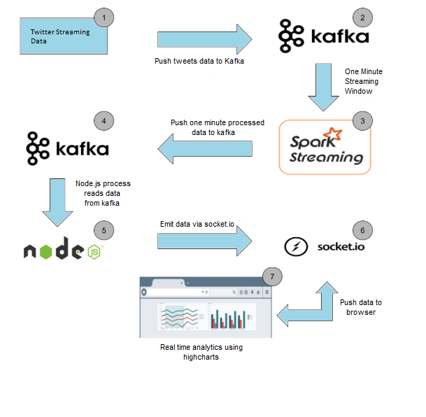
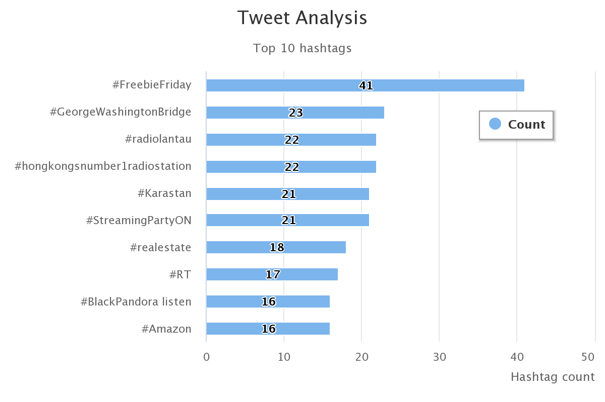
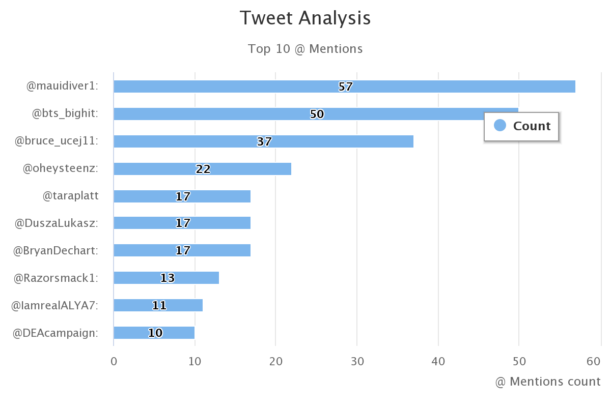

# 🐦 Real-Time Tweet Analysis Dashboard  
**Using Kafka, Spark Streaming, and Node.js**

A real-time analytics system that fetches live tweets, analyzes hashtags and mentions, and dynamically visualizes them on a web dashboard.

---

## 🚀 Features

- Live tweet ingestion using Twitter Streaming API  
- Real-time hashtag and @mention extraction  
- Kafka-based message queuing for scalability  
- Spark Streaming for micro-batch processing  
- Interactive dashboard with live chart updates

---

## 🛠️ Tech Stack

| Layer            | Technologies                                                                 |
|------------------|------------------------------------------------------------------------------|
| Frontend         | HTML5, CSS3, Bootstrap, Highcharts.js, Socket.IO                            |
| Backend          | Node.js, Express.js                                                         |
| Stream Processor | Apache Spark (PySpark)                                                      |
| Messaging Queue  | Apache Kafka                                                                |
| Language         | Python, JavaScript                                                          |

---

## 🧩 Architecture

```
Twitter API → Kafka Topic (raw tweets)
                  ↓
          Spark Streaming
       (process and filter data)
                  ↓
      Kafka Topic (processed data)
                  ↓
        Node.js Server + Socket.IO
                  ↓
     Real-Time Dashboard (Highcharts)
```



---

## 📦 Installation & Setup

### 1. Prerequisites
Ensure the following are installed:

- Python 3.x  
- Apache Kafka  
- Apache Spark  
- Node.js & npm  

### 2. Installation Steps

#### 🧱 Kafka & Spark
Follow these installation guides:

- [Install Kafka & Zookeeper](https://towardsdatascience.com/running-zookeeper-kafka-on-windows-10-14fc70dcc771)  
- [Download Spark](https://spark.apache.org/downloads.html)  

#### 🔧 Set Up Kafka Topic
```bash
kafka-topics.bat --create --zookeeper localhost:2181 --replication-factor 1 --partitions 1 --topic twitter
```

#### 🔐 Configure Secrets
Update your `conf` file with Twitter API credentials (API key, API secret, tokens).

#### 📦 Install Python Dependencies
```bash
pip install -r requirements.txt
```

#### 📦 Install Node.js Dependencies
```bash
npm install
```

---

## ⚙️ Running the Application

### 1. Start Zookeeper
```bash
zkserver
```

### 2. Start Kafka Server
```bash
kafka-server-start.bat path/to/server.properties
```

### 3. Fetch Tweets into Kafka
```bash
python fetch_tweets.py
```

### 4. Analyze Tweets via Spark
```bash
python analyze_tweets.py
```

### 5. Launch Node Server
```bash
npm start
```

---

## 📊 Dashboard Preview

| Trending Hashtags                     | Most Mentioned Users                 |
|--------------------------------------|--------------------------------------|
|             |             |

---

## 📈 How It Works

1. Tweets are streamed from Twitter and sent to Kafka.
2. Spark Streaming reads tweets in micro-batches, extracts top hashtags and mentions.
3. Processed results are sent back to another Kafka topic.
4. Node.js server consumes this and emits updates to clients via WebSockets.
5. Highcharts renders live updates on the dashboard every 60 seconds.

---

## 🤝 Contributing

Feel free to fork, enhance, or suggest improvements via pull requests!